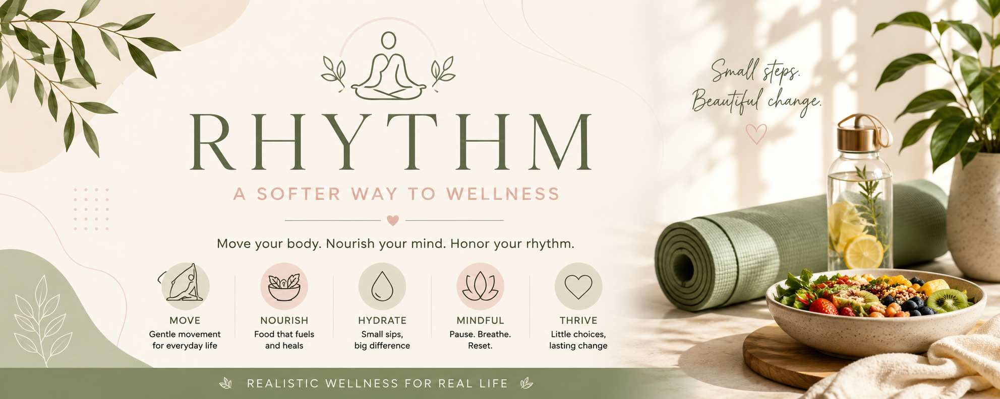
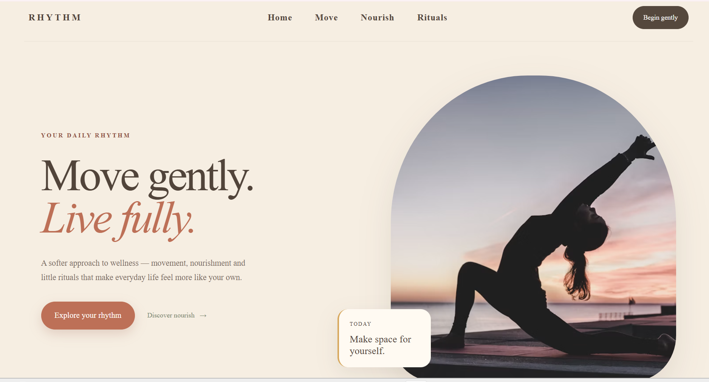

<p align="center">
  
</p>

<h1 align="center">RHYTHM — A Softer Way to Wellness</h1>

<p align="center">
  An interactive wellness web experience built around movement, nourishment, mindfulness, and small daily rituals.
</p>

<p align="center">
  <strong>Internship Project | Frontend Development</strong>
</p>

---

## About the Project

**RHYTHM** is an interactive wellness web experience developed as part of my internship project.

The project explores how thoughtful frontend design and JavaScript interactions can be combined to create a calm, engaging, and user-friendly wellness experience.

Rather than presenting wellness as a strict routine, RHYTHM focuses on small and sustainable actions through movement, nourishment, hydration, mindfulness, and daily reflection.

---

## Project Highlights

RHYTHM combines a visually focused interface with functional client-side interactions.

The experience includes:

* Interactive movement activities
* Hydration tracking
* Guided breathing exercise
* Daily intention prompts
* Interactive nourishment principles
* Plate builder
* Meal suggestions
* Daily activity tracking
* Dynamic progress calculation
* Smooth navigation
* Responsive design

---

## Preview

### Hero Section

<p align="center">
  
</p>

The landing section introduces the RHYTHM concept through a clean editorial-style wellness interface.

---

## Move

The Move section provides three interactive activities:

* Morning Yoga
* Mindful Walk
* Five-minute Stretch

Starting an activity updates the user's movement count in the Today section.

---

## Nourish

The Nourish section presents four simple wellness principles:

* Eat colorfully
* Keep it simple
* Stay hydrated
* Listen to your body

Selecting a principle dynamically updates its corresponding guidance.

---

## Daily Rituals

The Daily Rituals section provides small interactive experiences designed around everyday habits.

### Hydration

A six-step water tracker records the user's water intake.

### Breathing

A guided breathing interaction cycles through:

`INHALE → HOLD → EXHALE → REST`

### Daily Intention

Users can cycle through different daily reflections.

---

## Today Tracker

The Today section brings the user's activities together into one progress overview.

It tracks:

* Water consumption
* Movement moments
* Mindful moments
* Overall daily progress

The progress percentage updates dynamically as the user interacts with the website.

---

## Plate Builder

The Plate Builder allows users to select different food groups:

* Vegetables
* Protein
* Whole grains
* Fruit

The interface responds to the selected categories and provides simple meal suggestions.

---

## Technologies Used

* HTML5
* CSS3
* JavaScript
* DOM Manipulation
* Event Listeners
* CSS Animations and Transitions
* Responsive Web Design
* Google Fonts
* Unsplash Images

---

## Project Structure

```text
RHYTHM/
│
├── assets/
│   ├── css/
│   │   └── style.css
│   │
│   ├── js/
│   │   └── main.js
│   │
│   └── images/
│       ├── banner.png
│       ├── hero.png
│       └── ...
│
├── index.html
└── README.md
```

---

## Development Focus

This internship project provided practical experience in developing an interactive frontend from concept to implementation.

Key areas of focus included:

* User interface design
* Responsive web development
* Frontend structure
* JavaScript functionality
* DOM manipulation
* Interactive components
* State-based UI updates
* User experience
* Visual hierarchy
* Project organization

---

## Learning Outcomes

Through the development of RHYTHM, I gained practical experience with:

* Structuring a complete multi-section website
* Building responsive layouts
* Creating reusable JavaScript functions
* Connecting UI elements with JavaScript
* Handling user interactions
* Updating webpage content dynamically
* Creating interactive progress tracking
* Debugging frontend functionality
* Organizing a maintainable project structure

---

## Future Improvements

Future versions could include:

* Local storage for persistent progress
* User profiles
* Weekly wellness summaries
* Personalized recommendations
* Additional guided exercises
* Nutrition tracking
* Backend integration
* Database support
* AI-powered wellness recommendations

---

## Project Status

**Completed — Internship Project**

RHYTHM is currently implemented as a client-side interactive frontend using HTML, CSS, and JavaScript.

---

## Author

**Ayesha Zaib Warraich**

BS Artificial Intelligence Student

---

## License

This project was developed for educational and internship purposes.
